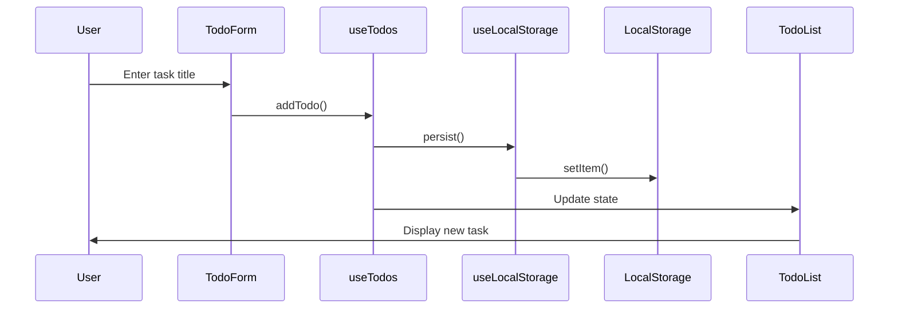

# Design Document

## Technical Architecture

### Component Structure
```
src/
├── components/
│ ├── TodoApp.tsx # Container component
│ ├── TodoForm.tsx # Task creation form
│ ├── TodoList.tsx # Task list display
│ ├── TodoItem.tsx # Individual task
│ └── TodoFilters.tsx # Filter controls
├── hooks/
│ ├── useTodos.ts # Task management logic
│ └── useLocalStorage.ts # Persistence layer
└── types/
└── todo.ts # TypeScript definitions
```

### Data Flow


### Technology Stack
- React 18 with TypeScript
- CSS Modules for styling
- localStorage API for persistence
- Custom hooks for state management

### Key Decisions
1. No backend - use localStorage for simplicity
2. Custom hooks to separate business logic from UI
3. CSS Modules to avoid style conflicts
4. Optimistic updates for better UX
